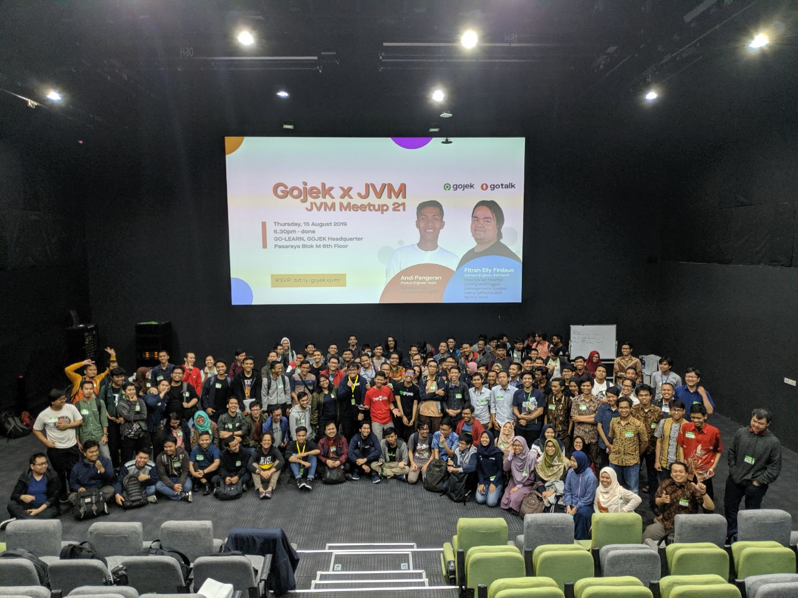
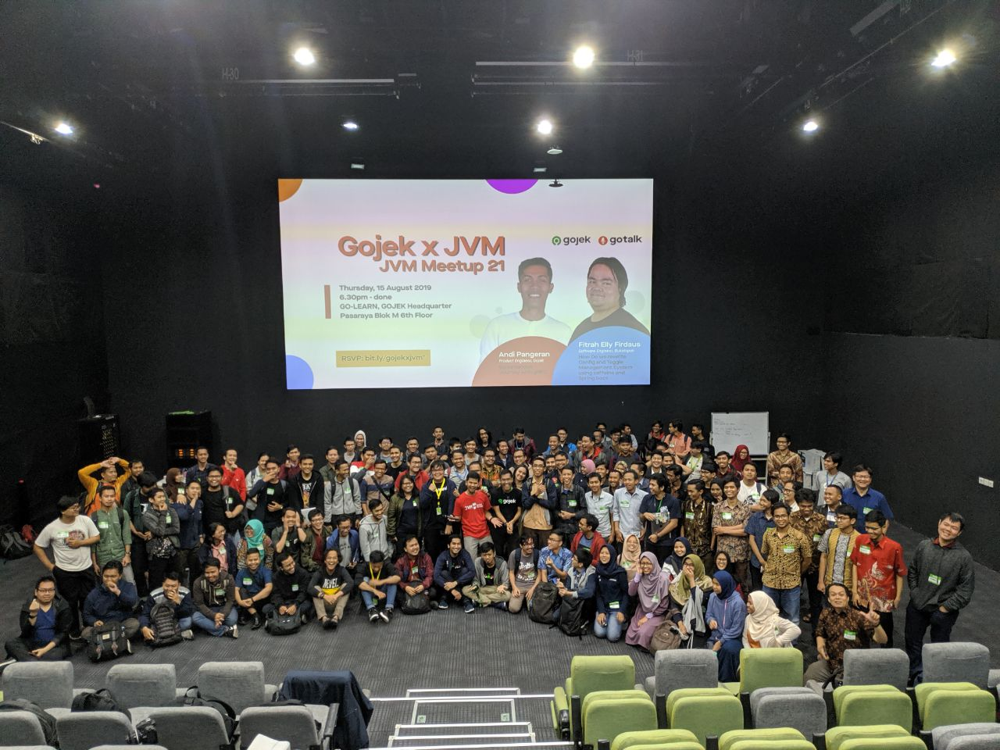
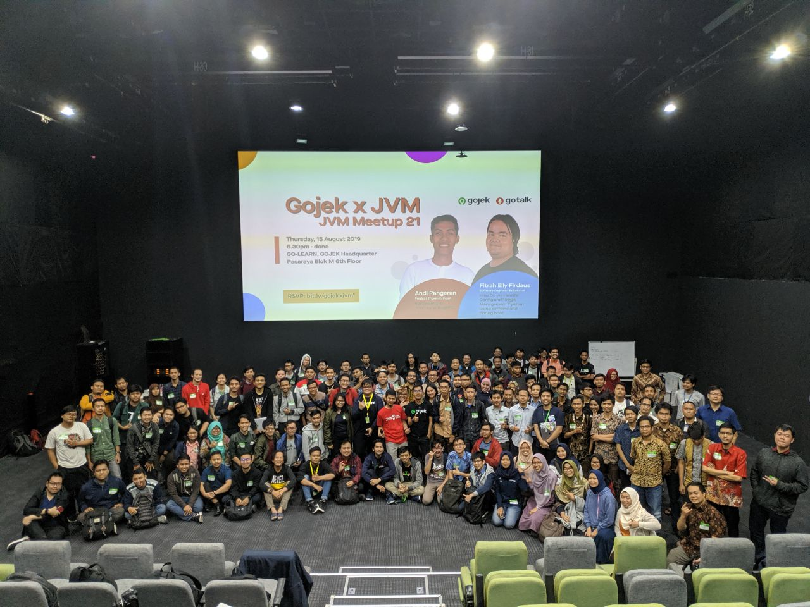
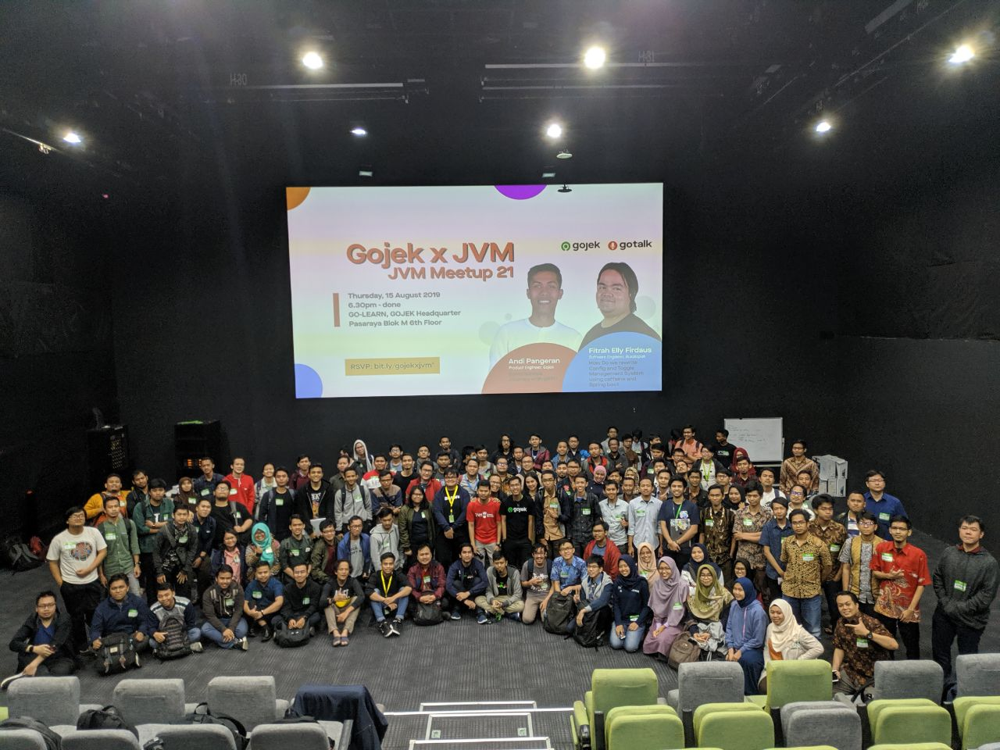

# JVM-Meetup-21
Summarize from JVM Meetup #21 "Gojek x JVM: Java in Production Environment"

Hari & Tanggal : Kamis, 15 Agustus 2019

Lokasi : GoJek HQ

Pasaraya Blok M Jakarta, RT.3/RW.1, Melawai, Kec. Kby. Baru, Kota Jakarta Selatan, Daerah Khusus Ibukota Jakarta 12160

Speaker : 

1. Andi Pangeran (Product Engineer, Gojek) : ["Synchronous Journey with gRPC"](https://drive.google.com/open?id=1WS8xvbaG0Yl6l875oDvG-JDpvXQyZFRi)

2. Fitrah Elly Firdaus (Software Engineer, Bukalapak) : "How Do we rewrite Config and Toggle Management System using caffeine and Spring boot."
 

## JVM MEETUP 21 PHOTO SESSION

Ayo join JVM User Group di telegram untuk diskusi lebih lanjut.

Join Us : [@JVMUserGroup](https://t.me/JVMUserGroup)

Like & Follow Instagram : [JVM Indonesia](https://www.instagram.com/jvmindonesia/)

Like & Follow : [JVM Developer ID](https://www.facebook.com/JVMDeveloperID/)

Subscribe : [JVM Indonesia](https://www.youtube.com/channel/UCXwXmQEQySqhqAMmys4N56w)